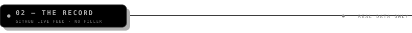
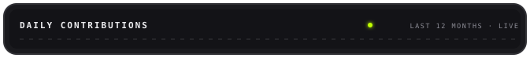
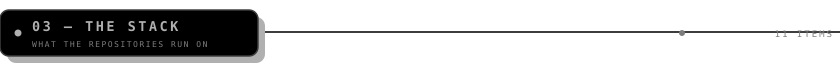
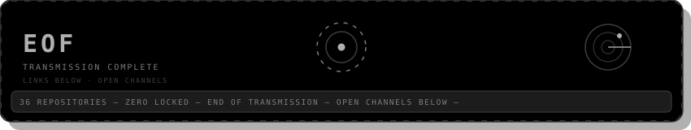

<!-- ═══════════════════════════════════════════════════════════════════════
     PRATHAM REDDY · README · v8 · SOFT BRUTALISM / ATMOSPHERIC SYSTEM
     GitHub renders SVG files as images (SMIL + CSS animations included),
     but it strips inline SVG markup and inline CSS from markdown. So every
     graphic in this file is an animated SVG committed to this repo under
     assets/ and referenced as an image. Nothing can be stripped.
     palette: Midnight Concrete #0D0D0F · panels #131317 · borders #2A2A2F ·
              text #EDEDF0 · meta #8A8A93 — neon core used sparingly:
              cyan #00FFFF (structure · cursor · radar), purple #BF00FF
              (signal blips), lime #C0FF00 (live indicators)
     style: soft bezel containers (24px radii), machined type (heavy
            sans headers + mono metadata), rim light on lit edges,
            digital dust grain, fragmented grid — no hard offset
            shadows, no number counting: final values fade in once
     structure: 01 hero (portrait, name, live counters, radar)
                01b console (animated terminal)
                02 the record (streak + daily chart, live from GitHub)
                03 the stack (6 languages · 5 tools)
                04 the signal (links + end stamp)
     deploy: commit README.md AND the assets/ folder together to the repo
       named PrathamReddy888. Layout:
         PrathamReddy888/PrathamReddy888
         ├── README.md
         └── assets/  (11 animated svg files)
     data honesty: counters and stack cells state the real repo facts
       (36 public repos, 6 languages, 5 tools); the streak and the daily
       chart are fetched live from GitHub on every view. No trophies.
     slots: NOW and WORK sections ship switched off at the bottom as HTML
       comments. To activate one, delete the line that starts with "SLOT:"
       and the line that ends with "◄ end of SLOT".
     ═════════════════════════════════════════════════════════════════════ -->

 
<!-- ══ 01b · THE CONSOLE ══ -->

 
<!-- ══ 02 · THE RECORD ══ -->

 

 

 

 
CONTRIBUTIONS · LAST 12 MONTHS · LIVE FROM GITHUB
 
<!-- ══ 03 · THE STACK ══ -->

 

 
<!-- ══ 04 · THE SIGNAL ══ -->

 
&nbsp;&nbsp;
&nbsp;&nbsp;

 

 
SOFT BRUTALISM v8 · MIDNIGHT &amp; NEON · 11 ANIMATED SVGS · LIVE DATA FROM GITHUB · SLOTS IN SOURCE

<!-- SLOT: NOW — your live focus rows. TO ACTIVATE: delete this line and the "◄ end of SLOT: NOW" line, then edit the rows. Duplicate a row to add items.

▸ <b>Edit me</b> — one line on the current focus.

▸ <b>Edit me</b> — duplicate this row for more items.

◄ end of SLOT: NOW -->

<!-- SLOT: WORK — your featured project cards in a GitHub-bordered 2-column grid. TO ACTIVATE: delete this line and the "◄ end of SLOT: WORK" line, then edit the cells. GitHub draws the table borders for you.
<table width="100%"><tr>
<td width="50%" valign="top" align="left"><b><a href="https://github.com/PrathamReddy888/REPO-NAME">PROJECT NAME ↗</a></b> One line on what this project does and why it matters. <kbd>TAG</kbd> <kbd>TAG</kbd></td>
<td width="50%" valign="top" align="left"><b><a href="https://github.com/PrathamReddy888/REPO-NAME">PROJECT NAME ↗</a></b> One line on what this project does and why it matters. <kbd>TAG</kbd> <kbd>TAG</kbd></td>
</tr></table>
◄ end of SLOT: WORK -->
