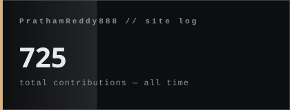
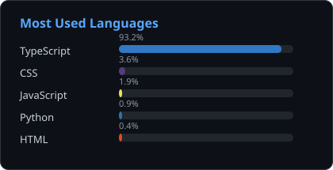

[`in/pratham-reddy`](https://www.linkedin.com/in/pratham-reddy-618948372/) &nbsp;·&nbsp; [`x/Pratham8008`](https://x.com/Pratham8008)

 

  

 

> **SITE LOG**

I'm a software engineer, building applications that are clean, efficient, and built to last.

My approach: write code that reads plainly, understand the real problem before reaching for a solution, and keep adding new architectural patterns to the toolkit.

I like taking a tangle of requirements and turning it into something straightforward and scalable.

---

> **STRUCTURE**

  
  

---

> **COORDINATES**

[`in/pratham-reddy`](https://www.linkedin.com/in/pratham-reddy-618948372/) &nbsp;·&nbsp; [`x/Pratham8008`](https://x.com/Pratham8008)

 

  concrete, fog, and version control

